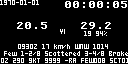

# espire - ESP32 framework for intelligent home and heating control

## ⚠️ Note

This is WIP currently on hiatus.  It was made back in summer of 2022
with recent ESP-IDF in a short time span and not published or deployed
yet.  Quick growth caused it to run into memory depletion when all
extra functions (mainly including HTTPS) are used and some
instability - from time to time it just drops WiFi connection or even
hangs.  Some of the issues were worked around (mainly memory depletion
by using alternative protocols like FTP where available) and improved.

It is fairly complete and stable but needs more testing and debugging.
Quick attempt of automatic reboot on long offline state does not seem
to work quite as expected - which is the single most important thing
for data collection (reboot once a day may be enough as it doesn't
happen so often).  I've also seen some issues on unstable WiFi which
may have been triggering the same issue, in that case reboot once a
day would not be applicable.

Additionally during CO2 sensor testing there occasionally seem to be
sensor hangs which I think was only fixed after power off instead of
reboot.  CO2 is not a planned feature so I haven't looked into it much.

I've been also planning to tinker with ESP-NOW if direct
client-controller connection would be feasible - as a method more
resilient to circumvent possible WiFi issues.  But it seems that it
can't work simultaneously with WiFi and that means no network access
on controller or client devices limiting usability, in addition to
more new code and complexity.  Solution with another proxy device
would still require WiFi to relay messages to controller.  One
strategically placed Access Point is better solution.  ESP-WIFI-MESH
may be more interesting than ESP-NOW or SoftAP for standalone network.

Due to the various factors it will take some time until this project
has priority again so I wanted to publish and back up it in current
state.

Future to-do list:

- (minor) add another thermistor component value used for exterior and
  possibly incorporate exterior temperature in controlling
- deploy, test and improve data collection stability
- may need to look into eBUS to control heating in addition to valves
- sending various data to time series database for analysis or monitoring
- figure out a way to make nice looking front panel for mounting
  display and buttons
  

## License

This work is licensed under GNU Affero General Public License 3.0 (AGPL).
You are required to provide source code to people you distribute the
program to and users of any devices which are using it.

## Goals

Main goals of this project are:

- heating controller (relays, thermistors)
- interactive thermostat devices
- automatic remote configuration
- automatic remote upgrade
- HTTP API for remote control and use by client devices
- ...and generally useful framework for building smart home

## Hardware

Using ESP-WROOM-32 dev board with 38 pins, one device is capable of using:

- 4 ADC1 input only pins - for thermistors
- 6 ADC2 pins - for thermistors (disconnecting WiFi for measurement)
- 8 GPIO pins - for controlling relay or buttons
- 2 ADC1 pins - for controlling relay or buttons
- 2 ADC2 pins - more pins for extra measurements, without matching relay

One controller can read 10 thermistors and control 10 matching relays
while providing REST API or other network functionality.

If there are client devices, those could do the measurements instead
of controller and send them via API, provide information via OLED I2C
display (settings, weather) and have interactive buttons to change
settings.  This should allow controller to use 4 ADC1 input pins (34,
35, 36, 39) and 6+2 ADC2 pins for other intermittent purposes.

### Possible alternatives

- Multiplexer with 16 channels - takes 1 ADC pin for signal and 4 for
controlling.  Uses less pins but 1 is still needed from ADC2.

- Two controllers for up to 6 pairs of thermistors and relay pins.
  This would require each client to be configured with the appropriate
  controller IP or communicate with multiple controllers.  Both could
  be easily managed with remote configuration.

- Collect temperature at client devices and send it via API.  In this
  situation controller does not have control over data collection and
  depends on working wireless network. (Encrypted, authenticated UDP
  datagram updates are sent to controller so this is the easiest
  option but other sources can still use API to submit zone
  temperature and trigger value.)
  
### Bill Of Materials

And some DuPont wires, breadboards or whatever is needed to put it all
together.

#### Controller

- ESP-WROOM32 38-pin (really need those pins for controller)
- NTC thermistors (e.g. 4K7) and matching resistors
- Relay 16x 12V (has 5V pin which can power controller and all client devices)
- Power supply 12V/3A

#### Client

- ESP-WROOM32 or similar
- SSD1306 128x64 Monochrome OLED (JMD0.96C I2C version)
- 3 push buttons (and pull-up resistor in case internal could not be used)

For client devices NodeMCU ESP8266 might just work but it's slower,
single core, 10-bit ADC and low memory.  And most importantly, it
would be more difficult to test and develop for two platforms -
hardware and SDK-wise.

## Project configuration

Some configuration is available in `idf.py menuconfig` which is
applied in `config.h`.

### Automatic remote configuration

Some changes can be applied by providing file `<MAC>` at preconfigured
URL.  `apikey` should be supplied as first key-value pair if `API_KEY`
is set.

## Overview

- `main` - entry point, initializing modules
- `config.h` - configurable value definition
- `device` - main initialalization of device, services, sleep loop
- `config` - override configurable values from non-volatile memory
- `module` - module management
- `dummy` - trivial example module
- `heap` - monitor free memory
- `check` - GPIO accounting
- `adc2` - ADC2 locking mechanism
- `temp` - thermistor measurements (using `esp32-thermistor`)
- `relay` - control heating with relay
- `heating` - heating control, client/controller communication
- `button` - button handling
- `log` - network loggin
- `ntp` - NTP synchronization
- `httpd` - HTTP/HTTPS server
- `http` - HTTPS requests
- `ftp` - FTP requests
- `ping` - tracking connectivity to trigger modules
- `metar` - download and parse METAR weather report
- `owm` - OpenWeatherMap forecast
- `shmu` - radar and satellite imagery (with additional service and 16-bit display)
- `util` - linked list, macros and other generally useful functions
- `wifi` - WiFi STA connection (based on example)
- `auto` - automatic remote configuration over HTTP
- `nv` - non-volatile memory management
- `ota` - OTA update over HTTP
- `widgets` - LVGL drawing
- `oled` - initially monochrome SSD1306 but tested with ST7735S
  (similar size) and ST7789 IPS screens
- `co2` - basic support for CO2 readings and sending via UDP (intended
  only for sensor testing), support for Senseair S8

Modules: `dummy`, `auto`, `metar`, `httpd`.  These are made to be
controllable via API but `auto` and `metar` are triggered by either
local network or internet availability.

`esp32-thermistor` has been modified and rewritten to use new
[`esp_adc/adc_cali.h`](https://docs.espressif.com/projects/esp-idf/en/latest/esp32c3/migration-guides/release-5.x/peripherals.html).

## Security

There are certain aspects that could be considered insecure (some if
`API_KEY` is not set):

- if HTTP and/or Basic HTTP auth is used then API KEY can be sniffed
  from API requests, autoconfiguration data or network logging
- in addition to sniffing, API key can be requested from
  autoconfiguration file if HTTP auth is employed
- NVS values can be logged during boot, their length in case of blob
  (e.g. WiFi password)
- there is possibility of dumping any value from NVS via HTTP API (if enabled)
- HTTP API requests are trusted
- autoconfiguration values can be logged (e.g. WiFi password)
- downloaded configuration is trusted and applied (hardcoded URL only)
- OTA update image is trusted (hardcoded URL only)
- UDP datagrams with temperature settings may be accepted without
  authentication if encryption is not enabled
- UDP datagrams are not protected against replay attack
  (needs reliable system time or synced NTP)

Default configuration with HTTPS, Digest auth, `API_KEY` and UDP
encryption cover most of these against simple remote attacks.  Log is
not encrypted so make sure log levels are not leaking sensitive
information or turn network logging off.

### Mitigations

Consider using [HTTPS server](#https-server), set `API_KEY` and
authentication for automatic remote configuration server.  Otherwise
anyone in your WiFi network could tamper easily with this system.
HTTPS requests are heavy on memory, see [Caveats](#https).

By default HTTPS server is enabled but `API_KEY` is blank.  If you're
using automatic configuration, set up HTTPS server with user/password
to protect `API_KEY`.  OTA firmware can also be downloaded from the
same HTTPS server.

Current implementation allows using [self-signed
certificates](#self-signed-certificates).

Using HTTPS does not prevent sniffing passwords when basic HTTP auth
method is used.  That in turn allows to retrieve automatic
configuration file by using the user/password which contains
`API_KEY`.  It is recommended not to switch to basic plaintext auth.

## LVGL

LVGL currently 8.3.  It's not thread safe so there is mutex.
Currently there is only task updating time and task for the rest of
UI.

## Features

### Network logging

Sending log messages to multiple hosts via UDP is supported.  There is
a dynamic buffer so early boot messages are not lost.  There is a
deliberate limit on length of single message when the buffer runs out
and of course possible loss of UDP packets.

Simplest collection of logs is with `socat` or `netcat`:

```sh
nc -ukl 8000 > device.log
socat UDP-LISTEN:8000,reuseaddr,fork OPEN:device.log,creat,append
```

Or append to file based on IP with collection script
[`collect.py`](util/collect.py) ([`systemd`
service](util/collect.service)) which saves to filename based on
source IP address and rotates logs when file limit is reached.

### Monitoring

In your deployment you can monitor number of writes via HTTP API
`/stats` value of `nv.writes`.

You can also monitor remaining heap size (via `/stats` or `/heap`) but
the result will be affected by the API call.

### OTA

Update is started on boot or when triggered via HTTP API `/ota` from
pre-configured URL in file `<MAC>.bin`.

### Buttons

Button handling is up to the application developer but current scheme is:

- Minus - change temperature by -0.1
- Plus - change temperature by +0.1
- Toggle:
  - short press when changed - reset temperature change
  - short press when not changed - cycle display modes
  - long press - save temperature change (when changed)
  - long press - negate temperature (when not changed)
  - 2s long press - display off
  - 5s reboot

### Display modes

- information screen (time, date, temperature setting, current
  temperature, weather info)
- clock (time, date, network status)
- off

Network status has two parts:

- `X`/`Y` - disconnected/connected to network
- `:`/`|` - preconfigured internet address ping failed/successful



Screenshots are kind of an experimental glitchy feature.

### HTTPS server

Be sure to adjust `HTTPD_MAX_URI_HANDLERS` to appropriate size,
restarting server seems to cause an issue with double handshake and
then fails.

HTTPS is turned on if `HTTPD_SSL` is defined.  Create certificates:

``` sh
openssl req -new -x509 -days 36500 -nodes -out certs/httpd.pem -keyout certs/httpd.key
```

`CONFIG_ESP_HTTPS_SERVER_ENABLE=y` has to be set.  Possible other
options in case of issues:

- "Header fields are too long": `CONFIG_HTTPD_MAX_REQ_HDR_LEN`
  increase (double to 1024 for Chrome requests to pass)
- `MBEDTLS_ASYMMETRIC_CONTENT_LEN` or increase outgoing fragment
  length

## API

Most of the requests are checking `apikey` parameter (if `API_KEY` is
set).  It's basically all `GET` with parameters because it's easy to
implement in C and easy to make read & write functionality in single handler.

### GET (and some POST)

Hopefully complete list of calls from `api.c`:

- `/` - test response
- `/loglevel` - set `tag` (string or `*`) to numeric level `level`
- `/log` - add network logging destination (`ip`, `port`)
- `/stats` - various information about system
- `/module` - control modules with identified by `name` or `id` and `run` (0/1)
  or POST multiple lines with format `name=run`
- `/auto` - `config` for oneliners or use POST to apply full config file
- `/export` -  export settings in autoconfiguration format (no WiFi password)
- `/nvdump` - dump value of `key` in namespace
- `/screenshot`
- `/debug` - start logging OLED refresh information
- `/oled` - `op` operation (`msg`, `invert`, `mirror`, `power`/`power_force`,
  `reset`, `reinit`, `mode`), `value` 0/1 or in case of `mode` it's
  number or in case of `mirror` e.g. `1,1` and nothing in case of
  `reset`/`reinit`
- `/button` - by default just use `id` or `name` (`+/-/toggle`), with
  `changed`/`repeats`/`longs` you can adjust other parameters of
  button press/release
- `/heap` - free heap size
- `/ota` - trigger OTA (with `force=1` and API key will force same version)
- `/gpio` - GPIO allocations
- `/temp/zone` - without `name` returns ADC+relay pins (`name=tpin+rpin`),
  with `name` sets either `adc` or `relay` pin number
- `/temp/get` - all or zone `name` values (current value and trigger value)
- `/temp/set` - set  zone `name` current value or trigger value (`val`/`set`)
- `/co2` - get FW version and ID
- `/co2/abc` - get ABC setting
- `/co2/ppm` - get PPM reading
- `/controller` - set controller IP to `value`
- `/hostname` - set hostname to `value`
- `/mac` - MAC address
- `/version` - app information
- `/reboot`

## Autoconfiguration

Also see "Self-signed certificates".  Be sure to provide HTTP server
with correct certificate and basic/digest HTTP auth as devices will be
attempting.

My project `simple-https-server` can provide HTTPS server with digest
auth to serve configuration and OTA updates.

### Keys

Hopefully complete list of configuration options from `auto.c`:

- `wifi.ssid=VALUE`
- `wifi.pass=VALUE`
- `controller_ip=VALUE` - IPv4
- `hostname=VALUE`
- `temp_zone_adc=NAME=PIN` - written to NVS as `tpin.NAME`
- `heating_relay=NAME=PIN` - written to NVS as `rpin.NAME`
- `tset.NAME=VALUE[float]` - `set` temperature value (controller)
- `th.udp.key=base64(VALUE)` - AES key (see UDP request security)
- `th.udp.iv=base64(VALUE)` - AES IV (see UDP request security)
- `th.udp.secret=VALUE[STR]` - passphrase to verify authenticity
- `th.udp.port=VALUE[U16]` - destination UDP port for temperature/thermostate updates
- `sleep.force=VALUE[U8]`
- `mode_default=VALUE[U8]` - also accepts names: `heating`, `clock`, `forecast`, `off`
- `oled_power=VALUE[U8]`
- `rm=KEY` - remove NVS key (from project namespace only)
- `write_str=KEY=VALUE[STR]` - remove after writing to not wear flash out with overwrites or use API call `/auto` to apply once
- `loglevel=NAME=VALUE[INT]`

## Caveats

### Socket limit

You can run into file descriptor limits depending on concurrent FTP
downloads (2), HTTP downloads (OWM, SHMU), API requests (2 per server
and then each request), ping (1), network log (1).  Adjust
`CONFIG_LWIP_MAX_SOCKETS`.  There is a limit of 16.

Currently there is a counting semaphore to prevent failures and wait
until socket is freed.  Each module will wait to prevent failure.
HTTPD will allocate one extra for incoming request.  Next step could
be having pool for HTTP/FTP so any other users will have some left.

### HTTP

There is a possibility to get chunks from `https_get` by using
`callback_stream` but `metar` and `auto` modules currently depend on
being able to allocate whole size or only download data partially.

### HTTPS

HTTPS requests can use a lot of heap.  Use sparingly, if at all.
METAR is provided only via encrypted URL so FTP is used instead (if
`METAR_FTP` is defined).

### FTP

`ftplib` is attempting to use these:

```
CONFIG_LWIP_SO_LINGER=y
CONFIG_LWIP_SO_REUSE=y
```

### Network logging

Without network connection or in case of log flood it will not grow
buffer past `LOG_MAX`.

### OLED SSD1306

I've been seing I2C error.  Task that updates time is detecting this
condition and attempting `reinit`.  The error reads:

```
lcd_panel.io.i2c: panel_io_i2c_tx_buffer(161): i2c transaction failed
```

Only tested with ESP-IDF driver.

### `sendto: Not enough space`

Too many datagrams are queueing unacknowledged on WiFi, increasing
`CONFIG_ESP32_WIFI_DYNAMIC_TX_BUFFER_NUM` or lowering period in
`thermostat_update` should help.  Or maybe increasing WiFi signal
quality.  This may be affected by collecting temperature too often on
ADC2 pins and reconnecting WiFi.

### Self-signed certificates

If you plan to use HTTPS self-signed certificate with OTA or automatic
remote configuration, use `CONFIG_ESP_OTA_HTTPS_INTERNAL` and
`CONFIG_ESP_AUTO_HTTPS_INTERNAL` (both default).  This will expect the
same certificate and corresponding domain name in the certificate as
HTTPS server used for API.  If you use OpenWRT, you can generate
certificate with domain e.g. `espire` and then set `espire` domain to
your server IP in `/etc/hosts`, reboot router and it will resolve this
name to the local address (`dig espire @gw`).  This is a proper setup
that will pass certificate name check and validates certificate.

if you care only about encryption, you need to set
`CONFIG_ESP_OTA_HTTPS_INSECURE` and `CONFIG_ESP_AUTO_HTTPS_INSECURE`
respectively .  In addition `CONFIG_ESP_TLS_SKIP_SERVER_CERT_VERIFY`
may be needed to.

For OTA with self-signed certificate set
`CONFIG_ESP_HTTPS_OTA_ALLOW_HTTP=y` otherwise it ends with error "No
option for server verification is enabled in `esp_http_client`
config."

Other modules do not skip verification.

### HTTP Digest

`CONFIG_ESP_HTTP_CLIENT_ENABLE_DIGEST_AUTH=y` otherwise you get error
"HTTP_CLIENT: This authentication method is not supported: Digest".

## Clock precision

Time may drift several minutes into future or past.  Lowering
`CONFIG_LWIP_SNTP_UPDATE_DELAY` to one minute (60000) seems to help
bring that back sooner.

Another alternative is instead of using default
`CONFIG_RTC_CLK_SRC_INT_RC=y` ("may drift in both Deep-sleep and
Light-sleep modes") using `CONFIG_RTC_CLK_SRC_INT_8MD256` ("at the
expense of a higher (by 5 μA) Deep-sleep current consumption").

## JTAG

It uses ADC2 - so no WiFi.  This makes it pretty much useless because
most complex things happen with network connection.  Enable by setting
`JTAG_DEBUG` to 1 in `config.h`.

I've tried CJMCU-FT232H (`0403:6014 Future Technology Devices
International, Ltd FT232H Single HS USB-UART/FIFO IC`).  OpenOCD seems
to use some kind of userspace driver and device permissions are not
respected so it requires `sudo`:

``` sh
sudo ~/.local/bin/openocd -f $OPENOCD_SCRIPTS/interface/ftdi/esp32_devkitj_v1.cfg -f $OPENOCD_SCRIPTS/target/esp32.cfg
```

Then just `idf.py gdbgui`.

Pins to connect to ESP32 are:

- GPIO12 — AD1 (TDI)
- GPIO15 — AD2 (TDO)
- GPIO13 — AD0 (TCK)
- GPIO14 — AD3 (TMS)

## Heating control

I wanted to hardcode as little as possible so initial setup can be
done over HTTP API or autoconfiguration.  There is one zone identifier
which client devices can use as hostname (if there are client
devices).

These values will be store on flash in case of power loss.

### Controller configuration

Specify GPIO pins for thermistor ADC reading and relay control:

```
#apikey=...
temp_zone_adc=room=36
temp_zone_relay=room=18
```

Keys created this way can be removed with API calls with value of -1
or even by using `rm=key` in autoconfiguration.

### Client configuration

```
#apikey=...
hostname=room
controller_ip=a.b.c.d
```

### Implementation notes

It's a bit messy because `temp`, `heating`, `oled` and a bit of
`relay` are intertwined.  There is UDP port open for listening - it
accepts requests for temperature reading and for setting desired
temperature.  This is periodically requested by clients in
`heating_update` or `button_handler`.

`temp_zone` is the place that identifies thermistor ADC and relay pins
by zone name.  `heating` stores `val` and `set` for current reading
and desired temperature, triggers relay action and also triggers
`oled_update` in various places.

Client hostname is formally unrelated but it doubles as zone
identifier.  Zone name is limited by NVS key length and prefix for
storing `temp_zone` values.

#### UDP request security

Simple AES-CBC encryption with secret was implemented.  There is a
simple utility for sending request from another device -
[`thudp.py`](util/thudp.py).

Controller doesn't accept updates to collected temperature values at
all because only local data collection is implemented.

You can use these commands to generate autoconfiguration entries
`th.udp.key` and `th.udp.iv` along with `th.udp.secret`:

```
openssl rand -base64 32
openssl rand -base64 16
```

Otherwise hardcoded values will be used (editable in `menuconfig`).

#### Sleep

Client devices don't have much to do so they sleep with no interactive
use.  Currently this means button activity or API authorization within
last 60 seconds.  Otherwise it will revert to clock display mode,
sleep for ~50s and wake up for ~10s.

At night (0 to 6) it will also disable OLED screen.  There are too
many possible variations of this behaviour so it is only hardcoded and
any customization should be done in code.

If `CONTROLLER_SLEEP` is true, controller will sleep too if NTP was
successfully synced.  This can make controller less responsive and
settings can take up to 50s to propagate from client devices.  Update
window is at the start of each minute of wall clock time.  Sleep can
be turned off with generic HTTP `module` API.

Controller can be forced to sleep at runtime with `sleep.force=1` in
automatic configuration.

## FAQ

### Basic initial setup

Fallback device configuration will have hostname "dummy" and zone name
should be configured with the same name to display temperature.  For
this to work there needs to be thermostat defined (thermostat
parameters and count) in device configuration `controller_defs`.  It
will then allocate GPIO pin.  Other configuration changes can be
delivered with autoconfiguration server at runtime.

GPIO pin allocation is logged after boot (or via API `/gpio`).  Next
step is configuring this PIN as NVS key via autoconfiguration server
`/MAC_ADDRESS` (may require valid certificate, use internal
certificate or basic/digest HTTP auth and also include `apikey=...`
value to authorize configuration).  API call to set pin is
e.g. `/temp/zone?name=dummy&adc=36&APIKEY=test`.  Autoconfiguration
alternative is `temp_zone_adc=dummy=36`

Old NVS keys need to be removed via autoconfiguration or `/auto` API
call (e.g. `rm=tpin.dummy`) in case of conflicting setup otherwise it
might think that zone temperatures obtained over network are actually
local.

Configuration options are available through `idf.py menuconfig` with
sane and mostly secure defaults.  API calls may require `APIKEY=`
parameter to authorize operations.
